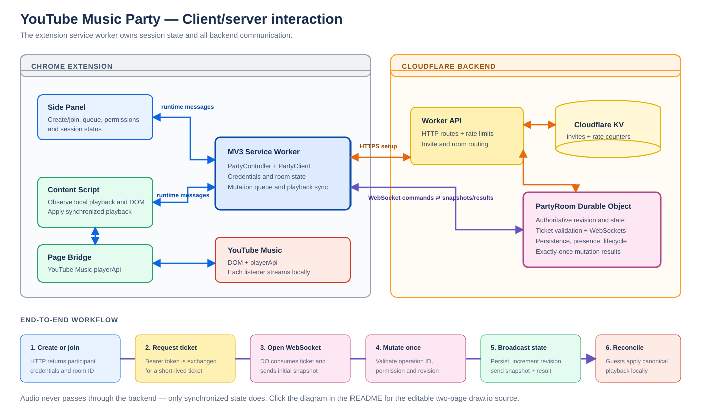

# YouTube Music Party

A Chrome extension and realtime backend for shared listening sessions on the YouTube Music web app.

## Current Implementation

- Shared TypeScript protocol and sync helpers in `packages/shared`.
- WXT extension scaffold in `apps/extension`.
- Cloudflare Worker and Durable Object room backend in `apps/backend`.
- Product docs in `PRD.md` and `layout.md`.

## Architecture

[](assets/client-server-workflow.drawio)

The preview links to the editable two-page [draw.io source](assets/client-server-workflow.drawio), which shows the extension contexts, Cloudflare backend, room setup and WebSocket synchronization loop. Open it with [diagrams.net](https://app.diagrams.net/) or the draw.io editor integration in your IDE.

For a detailed written description, see [the architecture and layout plan](layout.md).

## Local Development

Install dependencies first:

```sh
npm install
```

Run the backend:

```sh
npm run dev:backend
```

Run the extension:

```sh
npm run dev:extension
```

Run type checks and automated regression tests:

```sh
npm run check
npm test
```

Pull requests and pushes to `main` run the same checks, production builds, and
Playwright browser suite through `.github/workflows/ci.yml`.

Run the live Chrome extension smoke test:

```sh
npx playwright install chromium
npm run test:browser
```

The browser command builds the extension, starts an isolated local Wrangler backend, runs two-client room flows, validates selector fixtures on the YouTube Music origin, and checks extension loading.
Browser tests use `http://127.0.0.1:8797` so they do not reuse or disturb the normal development backend.

The extension defaults to `http://localhost:8787` for the backend. Override with `WXT_PUBLIC_PARTY_API_BASE_URL` if needed; this same value is resolved at build time to scope the manifest's `host_permissions` to that single backend origin (plus `music.youtube.com`), so set it for production builds.

The backend expects two KV namespaces: `INVITES` (invite-code mappings) and `RATE_LIMITS` (fixed-window request counters). Replace the placeholder ids in `apps/backend/wrangler.toml` with provisioned namespace ids before deploying.
