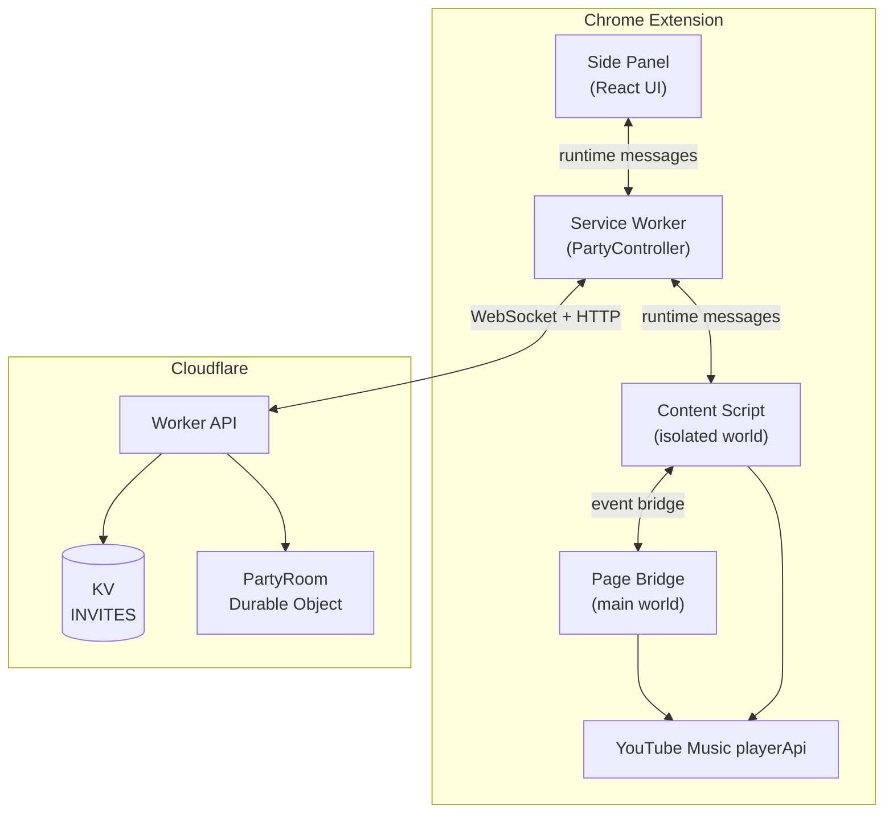

# Architecture

YouTube Music Party is a monorepo with three packages that communicate through typed messages and a WebSocket protocol.

## System Overview



The content script owns YouTube Music DOM interaction. The service worker owns session state, backend connections, and message routing. The Worker handles HTTP routing and rate limiting. The Durable Object owns authoritative room state.

## Monorepo Layout

| Package | Path | Purpose |
|---------|------|---------|
| `@ytm-party/shared` | `packages/shared/` | TypeScript types, message protocol, sync math |
| Extension | `apps/extension/` | Chrome MV3 extension built with WXT and React |
| Backend | `apps/backend/` | Cloudflare Worker + Durable Object room server |

All three packages share a base `tsconfig.base.json` with strict TypeScript settings. The shared package is referenced by both the extension and backend via npm workspaces and path aliases.

## Message Flow

### Extension Internal Messages

The extension uses Chrome's `runtime.sendMessage` API to route typed messages between three contexts:

```
Side Panel  ←→  Service Worker  ←→  Content Script
```

All internal messages use the `ExtensionRequest` / `ExtensionResponse` types defined in `@ytm-party/shared`. The service worker acts as the central router — the side panel and content script never communicate directly.

### Client ↔ Server Protocol

The service worker maintains a WebSocket connection to the backend when the user is in a party. Messages use the `ClientMessage` and `ServerMessage` types.

**Client → Server messages:**

| Type | Sender | Purpose |
|------|--------|---------|
| `clock.ping` | Any | Estimate server clock offset |
| `room.snapshot.request` | Any | Request current room state |
| `participant.status` | Any | Report local sync status |
| `permissions.update` | Host | Change guest permissions |
| `playback.host_state` | Host | Report play/pause/seek |
| `playback.skip` | Host or permitted guest | Skip to next queued song |
| `queue.add` | Host or permitted guest | Add a song to the queue |
| `queue.remove` | Host | Remove a queue item |
| `queue.reorder` | Host | Change queue order |

**Server → Client messages:**

| Type | Purpose |
|------|---------|
| `clock.pong` | Clock offset measurement response |
| `room.snapshot` | Full authoritative room state |
| `room.error` | Protocol or permission error |
| `operation.result` | Ack or reject a client mutation |

### Mutation Serialization

State mutations use a revision-based protocol:

1. The client sends an operation with an `operationId` and `expectedRevision`.
2. The server validates the operation against the current revision and permissions.
3. If accepted, the server increments the room revision, stores the operation acknowledgement, and broadcasts an updated `room.snapshot`.
4. The client receives an `operation.result` with `accepted: true` and the new `revision`.
5. Duplicate operations (same `operationId`) return the stored acknowledgement without re-executing.

This prevents stale mutations, provides exactly-once semantics, and enables reconnect recovery — pending operations are resent after a reconnect, and duplicates are safely ignored.

## Shared Protocol

The `@ytm-party/shared` package defines the data model and sync logic used by both client and server.

### Core Types

```typescript
type PartyRoomState = {
  roomId: string;
  revision: number;
  hostParticipantId: string;
  permissions: RoomPermissions;
  playback: PartyPlaybackState;
  queue: QueueItem[];
  participants: ParticipantState[];
};

type PartyPlaybackState = {
  track: Track | null;
  paused: boolean;
  positionSeconds: number;
  effectiveAtMs: number;
};

type RoomPermissions = {
  guestsCanSkip: boolean;
  guestsCanAddToQueue: boolean;
};
```

### Sync Math

The sync module calculates the expected playback position at any point in time:

- `currentPlaybackPositionSeconds(playback, nowMs)` — extrapolates position from `positionSeconds` and `effectiveAtMs`, accounting for pause state.
- `estimateClockOffsetMs(clientSent, clientReceived, serverSent)` — estimates the difference between client and server clocks using ping/pong round-trip time.
- `shouldMarkOutOfSync(localPosition, playback, nowMs)` — returns `true` when drift exceeds 2 seconds (the rejoin threshold).
- `shouldCorrectDrift(localPosition, playback, nowMs)` — returns `true` when drift exceeds 0.25 seconds (the gentle correction threshold).

### Runtime Validation

Instead of Zod, the shared package provides hand-written type guards (`isClientMessage`, `isServerMessage`, `isTrack`, etc.) that validate every inbound message at runtime. Field lengths are bounded to prevent abuse.

## Key Design Decisions

### Why Durable Objects?

Each party room is a single Durable Object instance. This gives each room:

- A single-threaded execution context (no concurrent mutation races)
- Built-in WebSocket management with `acceptWebSocket` / `handleWebSocket`
- SQLite-backed persistent storage for room state
- Alarm-based lifecycle management (presence checks, room expiration)
- Automatic geographic placement near the first participant

### Why WXT?

WXT provides a modern development experience for Manifest V3 extensions:

- TypeScript-first with auto-generated types
- Dev server with hot module replacement
- Clean entrypoint conventions (`background.ts`, `content.ts`, `sidepanel/`)
- React module integration via `@wxt-dev/module-react`

### Why Shadow DOM for Injected UI?

The extension injects UI elements into YouTube Music pages (menu actions, invite prompts). Shadow DOM isolation prevents YouTube Music's styles from affecting extension controls and vice versa. This is critical because YouTube Music uses aggressive CSS that would otherwise corrupt injected elements.

### Why Two Content Scripts?

- **Isolated content script** (`content.ts`) — runs in the extension's isolated world. Reads DOM, observes playback, handles messaging, and injects UI. Cannot access YouTube Music's JavaScript globals.
- **Main-world page bridge** (`page-bridge.content.ts`) — runs in YouTube Music's main world at `document_start`. Exposes safe wrappers around `playerApi.loadVideoById` and `playerApi.getVideoData()` through a CustomEvent bridge. This is necessary because the YouTube Music player API is only accessible from the page's own JavaScript context.

### Why Not Stream Audio?

Each participant uses their own YouTube Music account and subscription. The extension synchronizes which song plays and when, but audio comes from each user's own YouTube Music session. This avoids legal and technical complexity around audio relaying, respects subscription tiers, and works with YouTube Music's DRM.
