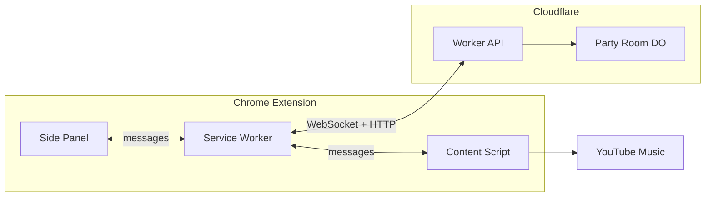

# YouTube Music Party

A Chrome extension and realtime backend that lets people listen together while each participant uses their own YouTube Music browser tab. A host creates a party, shares a link or short code, and manages a shared playback session and queue. Participants hear the same song at approximately the same time — no audio is streamed between users.

## Features

- **Create and join parties** using shareable links and short codes.
- **Synchronized playback** — the host's play, pause, and seek actions update playback for the entire party.
- **Shared queue** — songs play automatically in order; the host can remove and reorder items.
- **Guest permissions** — the host controls whether guests can skip or add songs to the queue.
- **Add songs from YouTube Music** — an injected "Add to party queue" action appears in YouTube Music's song menus.
- **Desync recovery** — if a guest pauses locally, encounters an ad, or drifts, they can rejoin playback with one click.
- **Host transfer** — if the host disconnects, authority transfers to the longest-connected guest after a grace period.
- **Keyboard shortcut** — `Alt+Shift+R` to rejoin playback instantly.

## How It Works

Each participant has their own YouTube Music tab and account. The extension observes and controls the local player, while a Cloudflare Durable Object backend maintains the authoritative room state (current track, playback position, queue, and permissions). Clients sync their local players to match.

## Current Status

The MVP is implemented and tested. See the [product requirements](https://github.com/your-org/youtube-music-party/blob/main/PRD.md) for scope details.

**Implemented:**

- Party creation, joining, and invite links with landing pages
- Realtime WebSocket rooms with revision-based state
- Host/guest permissions and queue management
- Playback synchronization with clock offset estimation and drift correction
- YouTube Music DOM integration with menu injection and context menu fallback
- Reconnection recovery and MV3 service worker session persistence
- Rate limiting, room lifecycle, and connection guards

**Not yet implemented:**

- User accounts and persistent profiles
- Friend lists and direct party invitations
- Queue voting and collaborative moderation

## Quick Links

- [Getting Started](getting-started.md) — install, run, and create your first party
- [Architecture](architecture.md) — system design and message flow
- [Extension](extension/overview.md) — how the Chrome extension is structured
- [Backend](backend.md) — API routes, Durable Objects, and room lifecycle
- [Testing](testing.md) — unit tests, browser tests, and CI
